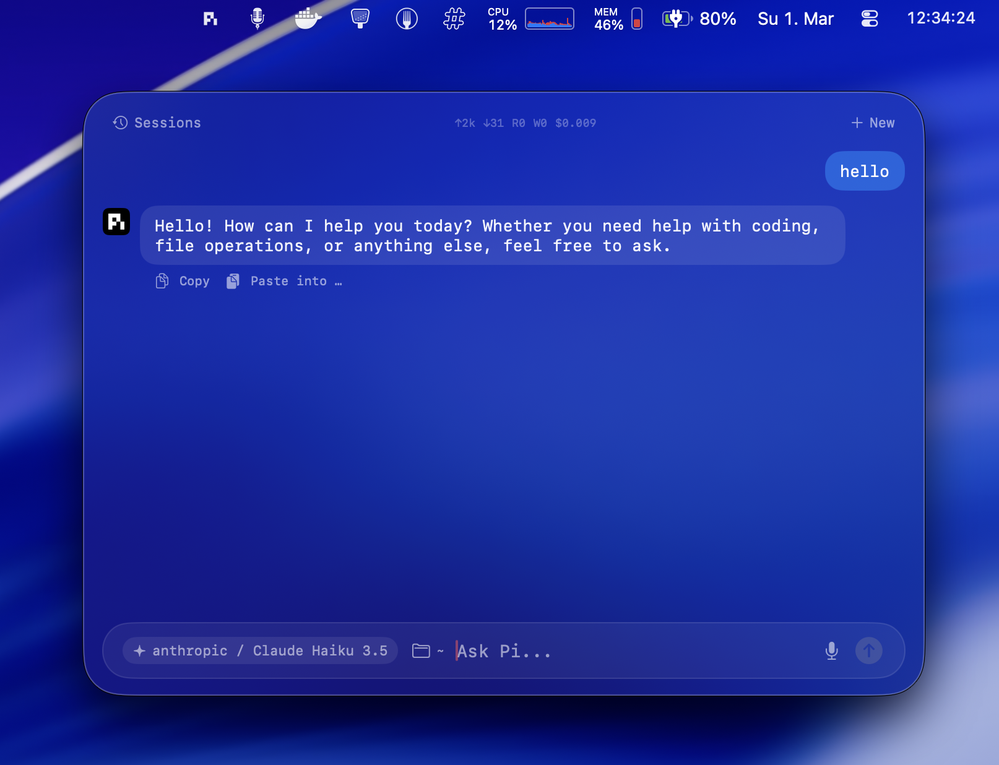

# Pi On

A native macOS menu bar app that puts [pi](https://github.com/badlogic/pi-mono) at your fingertips. Summon a floating AI chat panel from anywhere with a long-press of the Right Option key, ask a question, and paste the result straight back into whatever app you were using.



## Install

Download the latest DMG from the [Releases](https://github.com/patriceckhart/pi-on/releases/latest) page:

1. Download **Pi On.dmg**
2. Open the DMG and drag **Pi On** to your Applications folder
3. Launch Pi On — it will appear in your menu bar
4. Grant **Accessibility** and **Screen Recording** permissions when prompted

Requires [pi](https://github.com/badlogic/pi-mono) to be installed and on your PATH.

## What it does

Pi On runs as a menu bar item and spawns pi's RPC mode as a child process. It gives you a Spotlight-style floating panel with a full chat interface — model selection, image attachments, session history, token usage tracking, and one-click paste-back into the previously focused app.

## Features

- **Global hotkey** — Long-press Right Option (0.4s) to toggle the panel from any app, any Space, any fullscreen context.
- **Chat interface** — Streaming responses with monospaced text bubbles, image attachments (drag-and-drop or paste), and PDF support.
- **Model selector** — Switch between all models available through pi (Anthropic, OpenAI, etc.) directly from the input bar.
- **Session management** — Browse, search, and switch between previous pi sessions. Session files are read efficiently (only the first 8KB) so the browser stays fast even with hundreds of sessions.
- **Token stats** — Live display of input/output tokens, cache read/write, and cost for the current session.
- **Quick actions** — One-tap buttons for common tasks: rewrite as tweet, summarise, convert to Tailwind, write email.
- **Paste back** — Copy an assistant response and paste it directly into the app you were using before summoning Pi On. It remembers the frontmost app and simulates Cmd+V.
- **Working directory** — Pick a directory (or file) so pi operates in the right project context. Restarting the bridge re-spawns pi with the new cwd.
- **Screen capture** — Built-in ScreenCaptureKit integration for grabbing screenshots. On first launch it compiles a standalone `pi-screenshot` helper binary into `~/.pi/bin/`.
- **Drag and drop** — Drop images, PDFs, or files directly onto the chat area to attach them to your next message.

## Requirements

- macOS 14+
- [pi](https://github.com/badlogic/pi-mono) installed and on your PATH (or at `/usr/local/bin/pi`, `/opt/homebrew/bin/pi`, or under `~/.nvm/`)
- Accessibility permission (for the global hotkey event tap)
- Screen Recording permission (for screenshot capture)

## Building

Open `Pi On.xcodeproj` in Xcode and build. The app is a pure SwiftUI + AppKit project with no external dependencies.

```
open "Pi On.xcodeproj"
```

## Architecture

```
Pi On/
  Pi_OnApp.swift        App entry point. Menu-bar-only, no main window.
  AppDelegate.swift     Owns the NSStatusItem, PanelController, and HotkeyMonitor.
                        Installs the pi-screenshot helper on first launch.
  AppState.swift        Observable state: bridge lifecycle, chat messages, models,
                        sessions, token stats, quick actions, paste-back.
  PanelController.swift Floating NSPanel (KeyablePanel subclass). Centered on screen,
                        resizable, hides on Escape or click-outside.
  PanelChatView.swift   SwiftUI chat view: message bubbles, input pill with model
                        selector and working directory picker, attachment bar,
                        session browser sheet.
  PiBridge.swift        Spawns `pi --mode rpc --no-session`, communicates over
                        JSON-line stdin/stdout. Handles prompt, abort, model
                        switching, session switching, stats.
  HotkeyMonitor.swift   CGEvent tap (or NSEvent fallback) monitoring for long-press
                        of the Right Option key.
  SessionBrowser.swift  Reads ~/.pi/agent/sessions/ JSONL files. Parses only the
                        first 8KB of each file for speed.
  ScreenCapture.swift   ScreenCaptureKit wrapper for full-screen and per-window
                        capture, with LLM-friendly downscaling.
  ContentView.swift     Unused placeholder (default Xcode template).
```

## How it works

1. On launch, `AppDelegate` creates the menu bar icon, detects the pi binary path, and starts the `PiBridge` which spawns `pi --mode rpc --no-session` as a subprocess.
2. Communication happens over stdin/stdout using newline-delimited JSON. The bridge sends commands (`prompt`, `abort`, `new_session`, `get_available_models`, `set_model`, `switch_session`, `get_messages`, `get_session_stats`) and receives events (`agent_start`, `message_update`, `agent_end`, `tool_execution_start`, `tool_execution_end`, `response`).
3. The `HotkeyMonitor` installs a `CGEvent` tap to detect when the Right Option key is held for 0.4 seconds without any other key being pressed. When triggered, it toggles the floating panel.
4. The panel is an `NSPanel` subclass that floats above all windows, joins all Spaces, and animates in/out with opacity transitions.

## License

MIT
